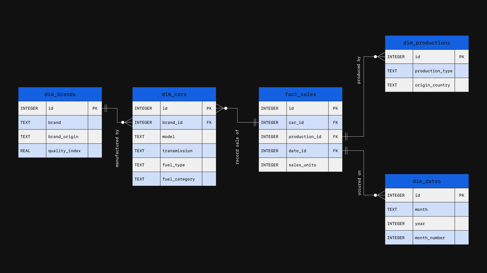
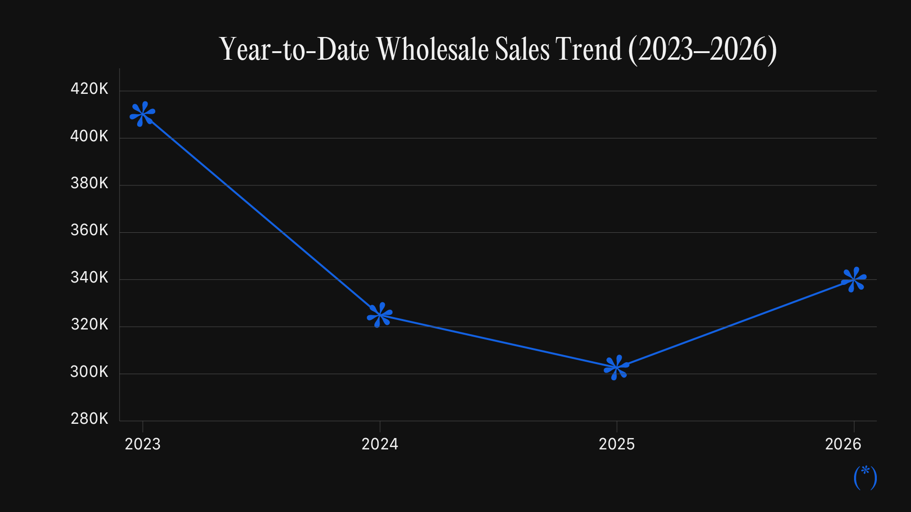
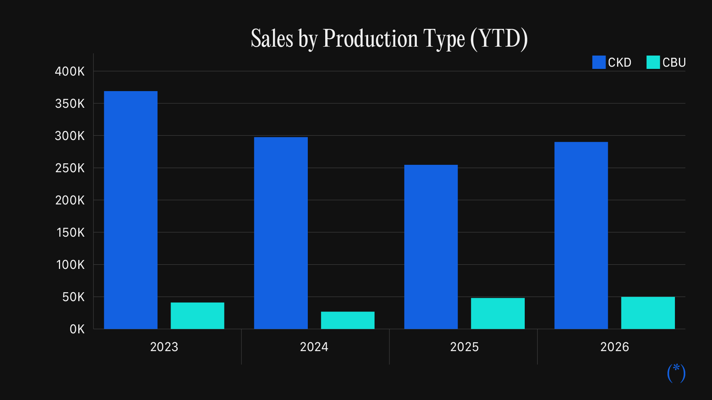
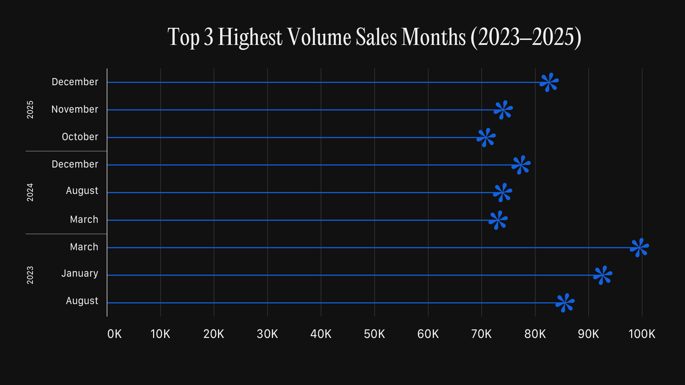

# Indonesia Automotive Sales Database
### SQL Market Analysis Project (2023–2026 YTD)

---

## Project Overview

This project builds a relational database to analyze Indonesian automotive market trends using GAIKINDO wholesale sales data from **2023–2026 YTD**. Starting from monthly reports in **PDF** format, I cleaned and transformed the data with **Power Query** before designing a normalized **Star Schema** in **PostgreSQL**.

The resulting database replaces disconnected source files with a structured system that enables efficient SQL analysis of market performance, brand leadership, production strategies, top selling models, and seasonal demand patterns.

## Key Business Questions

This project answers five core questions about the Indonesian automotive market:

1. **Market Pulse:** What is the total YTD wholesale sales volume trend by year?
2. **Market Share:** Which five brands hold the largest market share by wholesale sales?
3. **Production Strategy:** How is wholesale sales volume distributed between CKD and CBU vehicles?
4. **Top-Selling Models:** Which three models drive the highest wholesale sales within each of the top five brands?
5. **Seasonality:** Do wholesale demand peaks remain consistent year over year?

## Analytical Approach

To understand the market, I followed a top-down analytical approach that moves from overall market performance to the models driving individual brand sales.

I began with **Market Pulse** to establish the overall YTD market trend. Next, I identified the **Top Brands** through market share and examined their **Production Strategy** by comparing CKD and CBU sales. I then analyzed the **Top-Selling Models** to identify the primary volume drivers within each leading brand. Finally, I explored **Seasonality** to determine whether wholesale demand follows recurring patterns over time.

### Tools 🛠️

* **Excel Power Query:** Cleaned and transformed raw GAIKINDO PDF reports into structured tables.
* **PostgreSQL:** Built the relational database and performed SQL analysis.
* **VS Code:** Developed and executed SQL scripts.
* **Git & GitHub:** Managed version control and project documentation.

## Data Architecture (ERD)

The database is designed using a **Star Schema**, with `fact_sales` at the center and dimension tables describing brands, cars, production types, and dates.



*Entity Relationship Diagram of the database.*

For a detailed explanation of the ERD, entity definitions, and relationship mapping, see the [documentation.md](docs/documentation.md).

## Analysis 🔍

This section answers each business question using SQL, with queries shown both before and after creating `VIEW`s,

### 1. Market Pulse

To measure the overall market trend, I aggregated YTD wholesale sales by year. Since 2026 data is available through May, all years are limited to the same YTD period for a fair comparison.

**Before `VIEW`**
```sql
SELECT
    d.year,
    sum(s.sales_units) AS total_volume
FROM fact_sales s
    JOIN dim_dates d
        ON d.id = s.date_id
WHERE d.month_number <= 5
GROUP BY d.year
ORDER BY d.year DESC;
```

**Using `VIEW`**
```sql
SELECT *
FROM vw_market_pulse
ORDER BY year DESC;
```
**Key Insights:**
- Wholesale volume declined from **410,181 units** in 2023 to **302,603 units** in 2025, indicating a two-year market slowdown.
- The market began to recover in **2026 YTD**, reaching **339,962 units**, a **12.3%** increase over the same period in 2025, though still around **17% below** the 2023 level.

| year | total_volume |
|-----:|-------------:|
| 2026 | 339,962 |
| 2025 | 302,603 |
| 2024 | 324,911 |
| 2023 | 410,181 |


*Line chart showing YTD wholesale sales volume (January–May) by year.*

### 2. Market Share

To identify the market leaders, I calculated each brand's YTD market share and ranked them by wholesale sales volume for each year.

**Before `VIEW`**
```sql
WITH annual_brand_sales AS (
    SELECT
        d.year,
        b.brand_name,
        sum(s.sales_units) AS total_sold_units
    FROM fact_sales s
        JOIN dim_cars c
            ON c.id = s.car_id
        JOIN dim_brands b
            ON b.id = c.brand_id
        JOIN dim_dates d
            ON d.id = s.date_id
    WHERE d.month_number <= 5
    GROUP BY d.year, b.brand_name
),
market_share AS (
    SELECT
        year,
        brand_name,
        round(total_sold_units * 100.0 / sum(total_sold_units) 
            OVER (PARTITION BY year), 2) AS pct_market_share,
        rank() OVER (PARTITION BY year ORDER BY total_sold_units DESC) AS sales_rank
    FROM annual_brand_sales
)
SELECT *
FROM market_share
WHERE sales_rank <= 5
ORDER BY year DESC, sales_rank ASC;
```

**Using `VIEW`**
```sql
SELECT *
FROM vw_market_share
ORDER BY year DESC, sales_rank ASC;
```

**Key Insights:**
- **Toyota** consistently led the market with roughly **30–33%** share, followed by **Daihatsu**, which maintained a stable second position across all years.
- **Honda, Suzuki, and Mitsubishi Motors** remained the other dominant players, with rankings shifting slightly year to year while consistently occupying the top five.

| year | brand_name | pct_market_share | sales_rank |
|-----:|------------|-----------------:|-----------:|
| 2026 | TOYOTA | 29.98% | 1 |
| 2026 | DAIHATSU | 16.73% | 2 |
| 2026 | SUZUKI | 8.64% | 3 |
| 2026 | MITSUBISHI MOTORS | 8.00% | 4 |
| 2026 | HONDA | 5.37% | 5 |
| 2025 | TOYOTA | 33.33% | 1 |
| 2025 | DAIHATSU | 16.84% | 2 |
| 2025 | MITSUBISHI MOTORS | 8.54% | 3 |
| 2025 | HONDA | 8.33% | 4 |
| 2025 | SUZUKI | 6.78% | 5 |
| 2024 | TOYOTA | 31.44% | 1 |
| 2024 | DAIHATSU | 20.38% | 2 |
| 2024 | HONDA | 11.77% | 3 |
| 2024 | SUZUKI | 8.79% | 4 |
| 2024 | MITSUBISHI MOTORS | 8.55% | 5 |
| 2023 | TOYOTA | 32.01% | 1 |
| 2023 | DAIHATSU | 19.52% | 2 |
| 2023 | HONDA | 15.39% | 3 |
| 2023 | SUZUKI | 7.51% | 4 |
| 2023 | MITSUBISHI MOTORS | 7.17% | 5 |

### 3. Production Strategy

To compare production strategies, I aggregated YTD wholesale sales by production type (CKD vs. CBU) for each year, excluding records with unknown production types.

**Before `VIEW`**
```sql
SELECT
    d.year,
    p.production_type,
    sum(s.sales_units) AS total_sales
FROM fact_sales s
    JOIN dim_dates d
        ON d.id = s.date_id
    JOIN dim_productions p
        ON p.id = s.production_id
WHERE d.month_number <= 5
    AND p.production_type != 'Unknown'
GROUP BY d.year, p.production_type
ORDER BY d.year DESC, total_sales DESC;
```

**Using `VIEW`**
```sql
SELECT *
FROM vw_productions
ORDER BY year DESC, total_sales DESC;
```

**Key Insights:**
- **CKD (locally assembled)** vehicles consistently dominated the market, accounting for more than **85%** of YTD wholesale sales across all years.
- **CBU (fully imported)** vehicles represented a much smaller share, indicating that Indonesia's automotive market continues to rely heavily on local assembly.

| year | production_type | total_sales |
|-----:|-----------------|------------:|
| 2026 | CKD | 289,998 |
| 2026 | CBU | 49,817 |
| 2025 | CKD | 254,498 |
| 2025 | CBU | 47,947 |
| 2024 | CKD | 297,509 |
| 2024 | CBU | 26,878 |
| 2023 | CKD | 368,963 |
| 2023 | CBU | 41,039 |



*Column bar chart comparing YTD wholesale sales by production type (CKD vs. CBU).*

### 4. Top-Selling Models

To identify the key volume drivers, I ranked the top three best-selling models within each of the top five brands based on YTD wholesale sales.

**Before `VIEW`**
```sql
WITH annual_brand_sales AS (
    SELECT
        d.year,
        b.brand_name,
        sum(s.sales_units) AS total_brand_sales,
        rank() OVER (PARTITION BY d.year ORDER BY sum(s.sales_units) DESC) AS brand_rank
    FROM fact_sales s
        JOIN dim_cars c
            ON c.id = s.car_id
        JOIN dim_brands b
            ON b.id = c.brand_id
        JOIN dim_dates d
            ON d.id = s.date_id
    WHERE d.month_number <= 5
    GROUP BY d.year, b.brand_name
),
annual_model_sales AS (
    SELECT
        d.year,
        b.brand_name,
        c.model_name,
        sum(s.sales_units) AS total_model_sales
    FROM fact_sales s
        JOIN dim_cars c
            ON c.id = s.car_id
        JOIN dim_brands b
            ON b.id = c.brand_id
        JOIN dim_dates d
            ON d.id = s.date_id
    WHERE d.month_number <= 5
    GROUP BY d.year, b.brand_name, c.model_name
),
model_market_share AS (
    SELECT
        ams.year,
        ams.brand_name,
        ams.model_name,
        abs.brand_rank,
        ams.total_model_sales,
        round(ams.total_model_sales * 100.0 / NULLIF(sum(ams.total_model_sales) 
            OVER (PARTITION BY ams.year, ams.brand_name), 0), 2) AS pct_market_share,
        rank() OVER (PARTITION BY ams.year, ams.brand_name ORDER BY ams.total_model_sales DESC) AS model_rank
    FROM annual_model_sales ams
        JOIN annual_brand_sales abs
            ON abs.year = ams.year
            AND abs.brand_name = ams.brand_name
    WHERE abs.brand_rank <= 5
)
SELECT
    year,
    brand_name,
    model_name,
    pct_market_share,
    model_rank
FROM model_market_share
WHERE model_rank <= 3
ORDER BY year DESC, brand_rank ASC, model_rank ASC;
```

**Using `VIEW`**
```sql
SELECT *
FROM vw_top_models
ORDER BY year DESC, brand_rank ASC, model_rank ASC;
```

**Key Insights:**
- Several brands relied heavily on a single flagship model. **Honda Brio**, **Suzuki Carry**, and **Daihatsu Gran Max** consistently contributed a substantial share of their respective brand's wholesale sales.
- While **Toyota** maintained market leadership, its sales were distributed across multiple models, indicating a more diversified product portfolio than the other top brands.

| year | brand_name | model_name | pct_market_share |
|-----:|------------|------------|-----------------:|
| 2026 | TOYOTA | All New Kijang Innova G A/T Dsl 2022 | 5.30% |
| 2026 | DAIHATSU | Gran Max PU 1.5 STD AC PS | 30.35% |
| 2026 | SUZUKI | New Carry PU FD | 51.40% |
| 2026 | MITSUBISHI MOTORS | L300 D P/U FLD | 14.87% |
| 2026 | HONDA | Brio SATYA E | 48.93% |
| 2025 | TOYOTA | Calya 1.2 G 2022 | 8.30% |
| 2025 | DAIHATSU | Gran Max PU 1.5 STD AC PS | 19.97% |
| 2025 | MITSUBISHI MOTORS | Xpander 1.5L ULTIMATE (4X2) CVT | 18.73% |
| 2025 | HONDA | Brio SATYA E | 48.24% |
| 2025 | SUZUKI | New Carry PU FD | 32.33% |
| 2024 | TOYOTA | Calya 1.2 G 2022 | 9.84% |
| 2024 | DAIHATSU | New Sigra 1.2 R MT 2022 | 16.33% |
| 2024 | HONDA | Brio SATYA E | 43.23% |
| 2024 | SUZUKI | New Carry PU FD | 35.69% |
| 2024 | MITSUBISHI MOTORS | Pajero Sport 2.4L DAKAR (4x2) 8AT | 16.46% |
| 2023 | TOYOTA | Calya 1.2 G 2022 | 9.23% |
| 2023 | DAIHATSU | Gran Max PU 1.5 STD AC PS | 16.09% |
| 2023 | HONDA | Brio SATYA E | 31.99% |
| 2023 | SUZUKI | New Carry PU FD | 41.45% |
| 2023 | MITSUBISHI MOTORS | Xpander Cross 1.5L PREMIUM (4X2) CVT | 21.86% |

*For brevity, the table shows only the highest-ranked model (`model_rank = 1`) for each of the top five brands. The SQL query returns the top three models for every brand across all years.*

### 5. Seasonality

To identify recurring demand patterns, I ranked the top three highest-selling months for each year based on total wholesale sales.

**Before `VIEW`**
```sql
WITH monthly_sales AS (
    SELECT
        d.year,
        d.month,
        sum(s.sales_units) AS total_units,
        rank() OVER (PARTITION BY d.year ORDER BY SUM(s.sales_units) DESC) AS monthly_rank
    FROM fact_sales s
        JOIN dim_dates d
            ON d.id = s.date_id
    WHERE d.year BETWEEN 2023 AND 2025
    GROUP BY d.year, d.month
)
SELECT *
FROM monthly_sales
WHERE monthly_rank <= 3
ORDER BY year DESC, monthly_rank ASC;
```

**Using `VIEW`**
```sql
SELECT *
FROM vw_seasonality
ORDER BY year DESC, monthly_rank ASC;
```

**Key Insights:**
- Peak sales months varied across years, with **March** leading in 2023, **December** in 2024, and **October–December** dominating 2025.
- The shifting peak months suggest that wholesale demand does not follow a consistent seasonal pattern, making future demand less predictable.

| year | month | total_units | monthly_rank |
|-----:|-------|------------:|-------------:|
| 2025 | dec | 82,625 | 1 |
| 2025 | nov | 74,041 | 2 |
| 2025 | oct | 70,851 | 3 |
| 2024 | dec | 77,367 | 1 |
| 2024 | aug | 73,935 | 2 |
| 2024 | mar | 73,069 | 3 |
| 2023 | mar | 99,490 | 1 |
| 2023 | jan | 92,650 | 2 |
| 2023 | aug | 85,571 | 3 |



*Line chart highlighting the top three highest-selling months for each year (2023–2025).*

## Key Insights

* **Market Pulse:** 2026 YTD volume reached 339,962 units, a 12.3% recovery over 2025 and outpacing 2024, yet remaining 17% below 2023.
* **Market Leadership:** Toyota and Daihatsu remain dominant, while Suzuki, Mitsubishi, and Honda consistently round out the top five.
* **Production Strategy:** Locally assembled (CKD) units remain the primary driver, consistently capturing over 85% of total volume.
* **Top Models:** Sales are dominated by commercial models (Suzuki Carry, Daihatsu Gran Max, Mitsubishi L300) and passenger favorites (Honda Brio, Toyota Calya).
* **Seasonality:** Performance is inconsistent with no reliable seasonal peak, as top-performing months shifted significantly between 2023 and 2025.

## Performance Optimization

To improve query performance and maintainability, I optimized the database using B-Tree `INDEX` and reusable SQL `VIEW`s.

### Indexing `INDEX`

I added `INDEX` to frequently joined keys and date fields to improve join performance and time based filtering.

```sql
CREATE INDEX idx_sales_carid
    ON fact_sales (car_id);

CREATE INDEX idx_sales_productionid
    ON fact_sales (production_id);

CREATE INDEX idx_sales_dateid
    ON fact_sales (date_id);

CREATE INDEX idx_cars_brandid
    ON dim_cars (brand_id);

CREATE INDEX idx_dates_yearmonth
    ON dim_dates (year, month_number);
```

### SQL `VIEW`s

I encapsulated each business question into a reusable SQL `VIEW`, making the analysis easier to query while keeping the business logic centralized.

For the complete `VIEW` definitions and implementation details, see the [documentation.md](docs/documentation.md) or [schema.sql](schema.sql).

## Limitations

- **Wholesale Data Only:** The analysis is based on GAIKINDO wholesale shipments (manufacturer to dealer) and does not reflect retail sales, customer purchases, or vehicle registrations.
- **No Vehicle Segmentation:** Body type information (e.g., SUV, MPV, Sedan) was missing or inconsistent in the source data, preventing segment level analysis.
- **No Financial Metrics:** The dataset contains unit sales only and excludes pricing, revenue, discounts, taxes, and other financial information.
- **Limited Timeframe:** The database covers January 2023 through May 2026. Extending the analysis requires cleaning and importing additional GAIKINDO releases.

## What I Learned

- Designed and implemented a **Star Schema** to transform unstructured PDF reports into a normalized relational database.
- Strengthened my SQL skills by applying **CTEs, Window Functions, and SQL `VIEW`s** to solve business-driven analytical questions.
- Improved query performance by applying **B-Tree `INDEX`** on frequently joined and filtered columns.
- Gained hands on experience building an end-to-end analytics workflow, from data cleaning and modeling to SQL analysis and data visualization.
- Learned to translate business questions into structured SQL queries and communicate the findings through clear, insight driven storytelling.

## Documentation

For readers interested in the database implementation, detailed documentation is available in the [documentation.md](docs/documentation.md), including the ERD, entity definitions, relationship mapping, and SQL `VIEW`s.